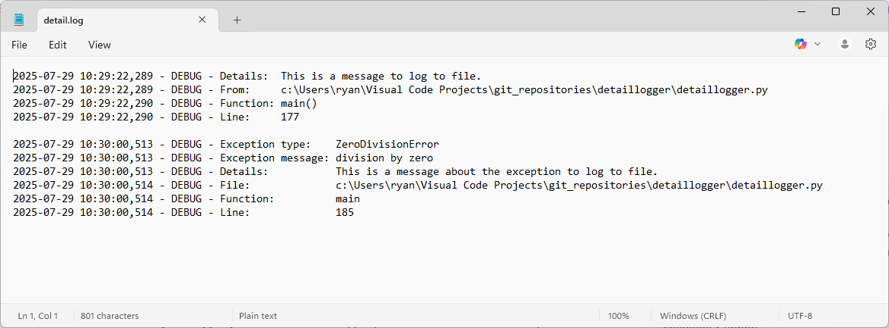

# 📋 DetailLogger

[](https://www.python.org/downloads/)
[](LICENSE)
[](https://github.com/rlapine/detaillogger/stargazers)
[](https://github.com/rlapine/detaillogger/network/members)
[](https://github.com/rlapine/detaillogger/actions)

**Version:** 1.1  
**Date:** July 29, 2025

DetailLogger is a lightweight Python utility for enhanced logging and exception tracing. It automatically captures contextual information—such as file name, function, and line number—whenever messages or exceptions are logged. Ideal for debugging, monitoring, and building maintainable systems.

---

## 📦 Installation

Clone this repository:

```bash
git clone https://github.com/rlapine/detaillogger.git
cd detaillogger
```

No external dependencies are required.

---

## ⚙️ Features

- ✅ Logs messages with caller context  
- ✅ Captures exceptions with full traceback  
- ✅ Supports console and file-based logging  
- ✅ Uses wrapper functions for quick integration  
- ✅ Built entirely on standard libraries

---

## 🧪 Usage

### Run the built-in CLI for testing:

```bash
python detaillogger.py
```

### Embedded Example

```python
from detaillogger import log, log_exception

log("This is a message to log.")

try:
    x = 1 / 0
except Exception as e:
    log_exception(e, details="This is a message about the exception to log.")
```

**Console Output:**

```
2025-07-28 17:02:27,674 - DEBUG - Details:  This is a message to log.
2025-07-28 17:02:27,674 - DEBUG - From:     c:\Users\ryan\...detaillogger.py
2025-07-28 17:02:27,675 - DEBUG - Function: main()
2025-07-28 17:02:27,675 - DEBUG - Line:     3

2025-07-28 17:05:22,185 - DEBUG - Exception type:    ZeroDivisionError
2025-07-28 17:05:22,186 - DEBUG - Exception message: division by zero
2025-07-28 17:05:22,186 - DEBUG - Details:           This is a message about the exception to log.
2025-07-28 17:05:22,186 - DEBUG - File:              ...detaillogger.py
2025-07-28 17:05:22,186 - DEBUG - Function:          main()
2025-07-28 17:05:22,186 - DEBUG - Line:              6
```

### Embedded Example

```python
# To log to a file and console, instantiate DetailLogger class with filename.
from detaillogger import log, log_exception

logger = DetailLogger(file_name="detail.log")

log("This is a message to log to file.")

try:
    x = 1 / 0
except Exception as e:
    log_exception(e, details="This is a message about the exception to log to file.")
```

**File Output:**



---

## ✍️ API Overview

- `DetailLogger(level, fmt, file_name)`: Create an instance with optional file output and log level  
- `log(message: str)`: Logs message with caller metadata  
- `log_exception(ex: BaseException, details: Optional[str])`: Logs exception type, message, optional details, and source context

---

## 🧱 File Structure

```
detaillogger/
├── detaillogger.py       # Core module
├── test_detaillogger.py  # Unit test suite
├── README.md             # Documentation
├── detaillogger.log      # Optional output log file
```

---

## 🚦 Continuous Integration

Tests are run on every push and pull request using GitHub Actions.  
You can view results [here](https://github.com/rlapine/detaillogger/actions).

---

## 🛠️ Future Enhancements

- Support asynchronous logging  
- Add JSON output mode  
- Enable depth-limited stack inspection
- Add db logging

---

## 🤝 Contributing

Pull requests are welcome! For major changes, open an issue to discuss improvements first.

---

## 📄 License

This project is licensed under the [MIT License](LICENSE).

---

## 👤 Author

Created by Ryan LaPine [@rlapine](https://github.com/rlapine) — a technically skilled developer focused on clarity, maintainability, and audience-ready documentation. This class is part of a broader effort to build reusable, well-documented tools for data-driven projects.

---

## 📬 Contact

Feel free to reach out with questions or collaboration ideas:

📧 github.stunt845@passinbox.com  
🔗 GitHub: [@rlapine](https://github.com/rlapine)
```

---

